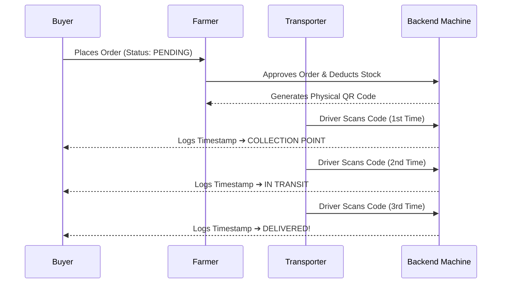

<div align="center">
  
  <h1>🌾 FarmTrack: Advanced Rural Supply Chain Network</h1>
  <p><strong>A Next-Generation Logistics & E-Commerce Platform Connecting Farmers Directly to Buyers with Real-Time QR Tracking.</strong></p>

  <p>
    
    
    
  </p>
</div>

<hr />

## 🌟 Overview

**FarmTrack** completely revolutionizes the agricultural supply chain by eliminating middlemen. It provides an end-to-end e-commerce logistics platform featuring three distinct interfaces tailored specifically for **Farmers**, **Buyers**, and **Transporters**. 

The crown jewel of the platform is the **Automated QR-Code Tracking Engine**. Unlike legacy systems that rely on manual data entry, FarmTrack generates secure cryptographic QR codes. Delivery drivers simply point their smartphone cameras at the package, and the system automatically advances the global state machine and pushes real-time live updates directly to the buyer's screen.

## ✨ Core Features

### 👨‍🌾 1. The Farmer Portal
* **Live Inventory Engine:** Add, update, and manage crop stock with real-time UI updates.
* **Order Management & Fulfillment:** Receive incoming orders dynamically. Clicking "Approve" safely deducts stock using MySQL row-level locking (`FOR UPDATE`) to prevent double-selling.
* **Automated QR Generation:** The moment an order is approved, the system generates a secure tracking barcode dynamically natively in the browser, ready to be printed or scanned off the screen.
* **Analytics Dashboard:** Instantly view active orders, revenue generated, and low-stock alerts.

### 🛒 2. The Buyer Portal
* **Live Paginated Catalog:** Blazing-fast browsing with instant 10-item pagination and 3-character live predictive search.
* **Frictionless Cart:** Seamless, full-page checkout flow without ever refreshing the page.
* **Amazon-Style Order Cards:** View horizontal summary cards of previous purchases, total costs, and color-coded statuses.
* **Real-Time Polling UI:** Open the "Track Order" modal and watch it update live. If a driver scans your package out in the field, your progress bar instantly fills green without refreshing the page!

### 🚚 3. The Transporter & Logistics App
* **Universal Camera Scanner:** Deep integration with the `html5-qrcode` library. Tap "Scan" to securely hijack the device camera (laptop or smartphone) into a high-speed barcode viewfinder.
* **Blind State Machine Automation:** The transporter doesn't need to choose statuses. Scanning a QR code automatically audits the package and advances it: `Pending` ➔ `Hub Scan` ➔ `In Transit` ➔ `Delivered`.
* **Delivery Ledger:** Complete historical audit trail of all packages scanned by the logged-in driver.

## 🏗️ Architecture & Workflows

### The Zero-Friction Logistics Flow


## 🔒 Security & Under the Hood

* **Transaction Safety:** Utilizes robust `mysqli_begin_transaction()` and `mysqli_rollback()` patterns across the API to guarantee zero data-corruption during checkout and stock deduction.
* **Identity Management:** Fully integrated with Google OAuth 2.0 alongside traditional cryptographically hashed (`bcrypt`) email/password sign-in.
* **API Structure:** 100% decoupled frontend/backend architecture. All interactions are handled via RESTful `fetch()` calls communicating with modular PHP endpoints returning pure JSON.

## 🚀 Getting Started

1. **Clone the Repository**
   ```bash
   git clone https://github.com/navneetyadav-code/hack2.git
   ```
2. **Database Setup**
   * Start your XAMPP Apache & MySQL servers.
   * Import the provided SQL schema to create the `my_db` database.
   * Ensure `db_conn.php` points to your local `root` credentials.
3. **Run the Application**
   * Navigate to `http://localhost/hack2` (or your specific path).
   * Register as a Farmer to add inventory, open an Incognito window as a Buyer to purchase it, and use your phone as a Transporter to scan the magic QR code!

---
<div align="center">
  <i>Engineered for the Modern Agricultural Supply Chain</i>
</div>